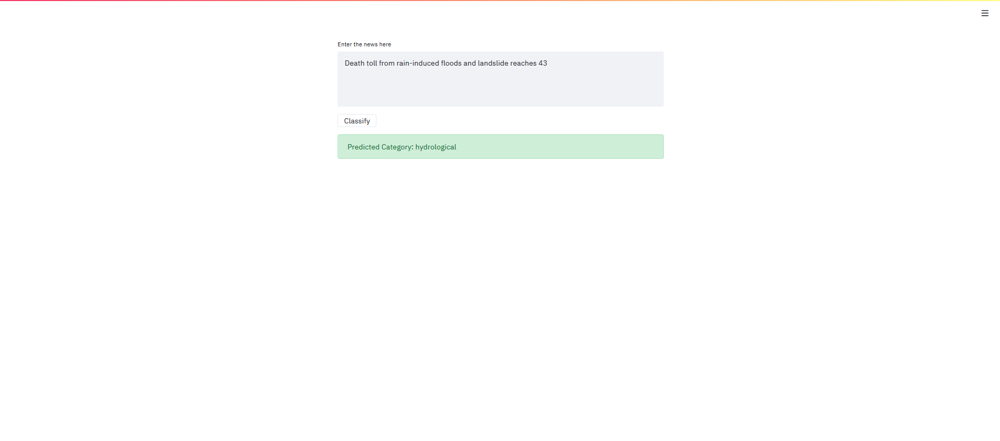

**Steps to run API**

1.  Change directory to the repository folder

    -   `cd disaster_news_classification`

2.  Build docker image

    -   `docker image build --tag disaster_news_classification .`

3.  Run the docker image and specify the queue size limitation
    -   `docker container run --rm --publish 8000:8000 disaster_news_classification`

**Steps to run UI**

1. Change directory to repository folder

    -   `cd disaster_news_classification.`

2.  Run the streamlit application

    -   `streamlit run news_classifer_ui.py`

3.  Access the user interface at port 8501 of your local/remote server

